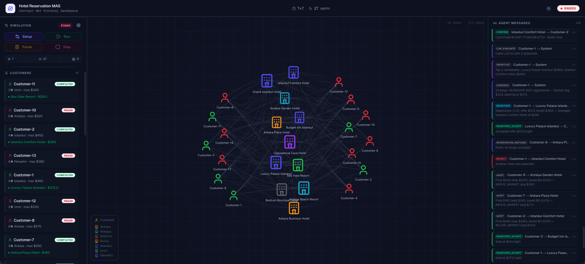
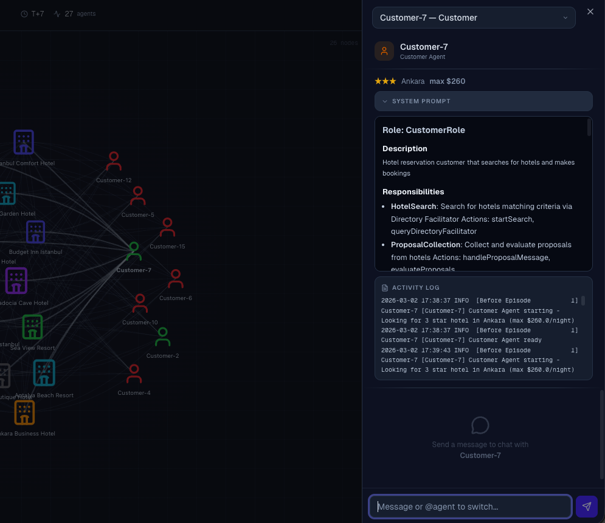

# Contract Net Protocol Dashboard

Real-time monitoring and interaction dashboard for the Hotel Reservation Multi-Agent System.



## Features

### Simulation Control
- **Setup / Run / Pause / Stop** controls with real-time state indicators
- Configurable simulation parameters (tick delay, timeout, negotiation rounds)
- Live tick counter and agent status tracking

### Network Topology
- Interactive graph visualization of hotel and customer agents (vis-network)
- Color-coded edges showing CNP message flow (CFP, Proposal, Accept, Confirm)
- Click any node to inspect the agent's details

### Customer & Hotel Panels
- Left sidebar with live customer reservation statuses (COMPLETED / FAILED / IN_PROGRESS)
- Hotel agent listing with room availability and pricing info

### Activity Feed
- Right sidebar with chronological agent message log
- Message type badges: `CFP`, `PROPOSAL`, `LLM_EVALUATE`, `NEGOTIATE`, `CONFIRM`, etc.
- Auto-scrolls to latest activity

### Agent Chat & Inspection



- Slide-over panel for any agent: system prompt, role, responsibilities
- Full activity log filtered to the selected agent
- **Live chat** interface to converse with agents via their LLM backend

### Dark / Light Theme
- System-aware theme toggle in the navbar
- Glass-panel aesthetic with smooth transitions

## Getting Started

### Prerequisites

- **Node.js 18+**
- **pnpm** (recommended)
- Backend running on `http://localhost:8000` (see [root README](../README.md))

### Install & Run

```bash
pnpm install
pnpm dev
```

Open [http://localhost:3000](http://localhost:3000) in your browser.

### Build for Production

```bash
pnpm build
pnpm start
```

